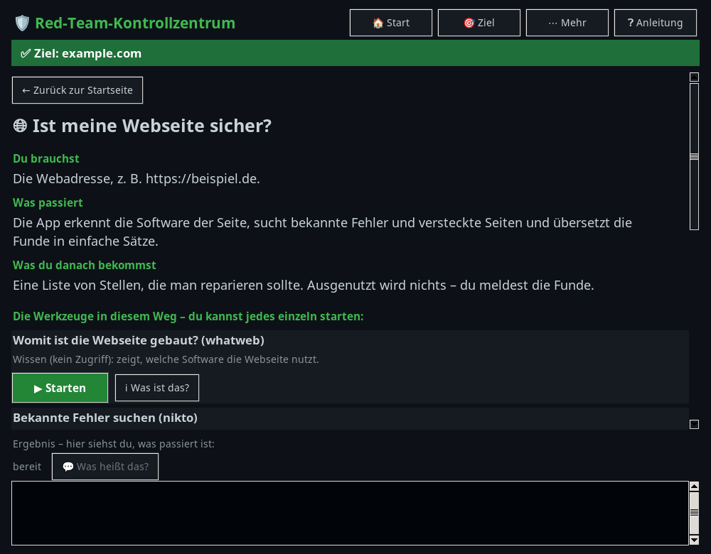
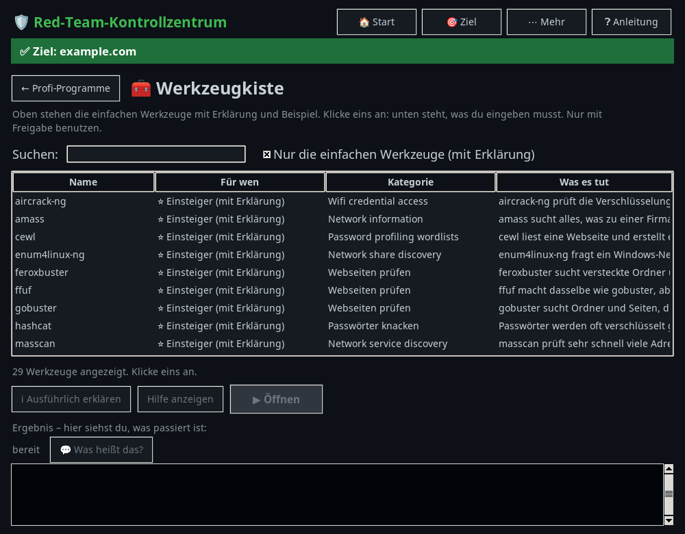
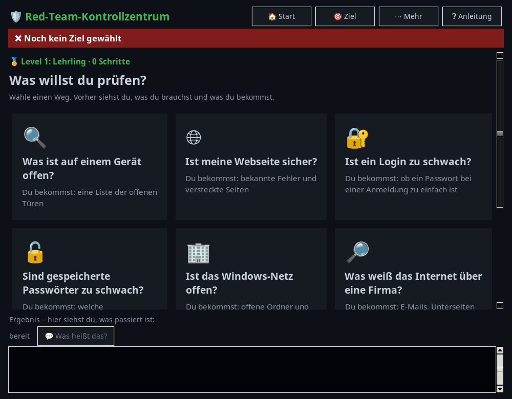
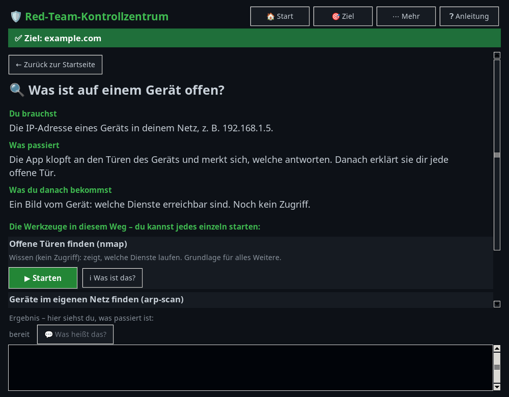
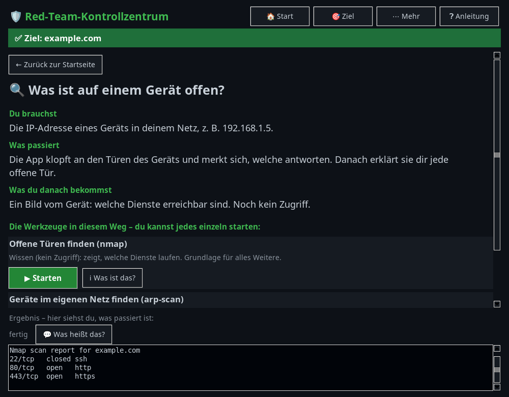
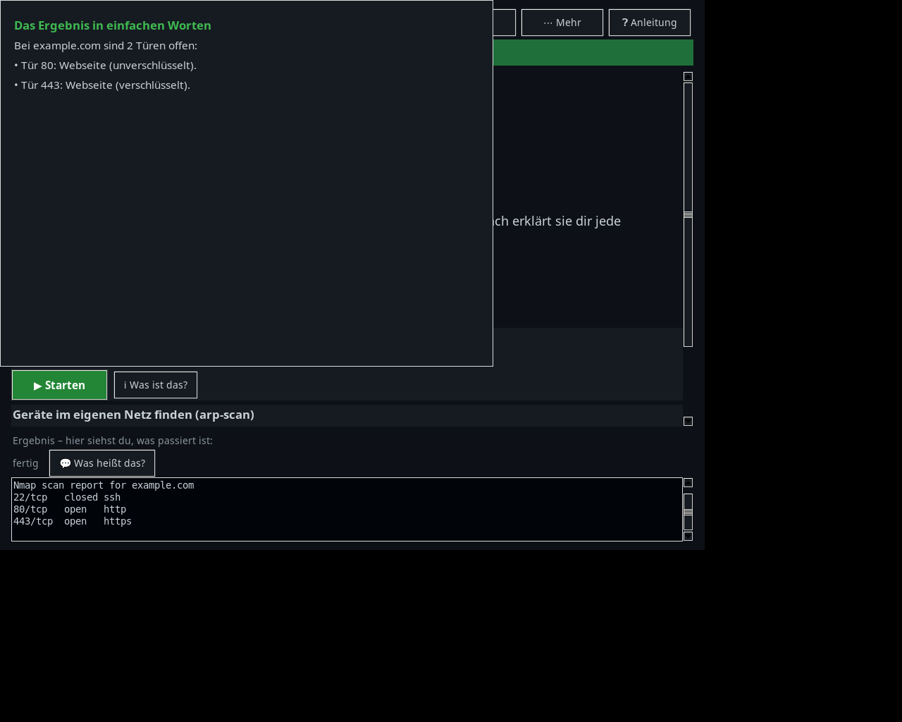
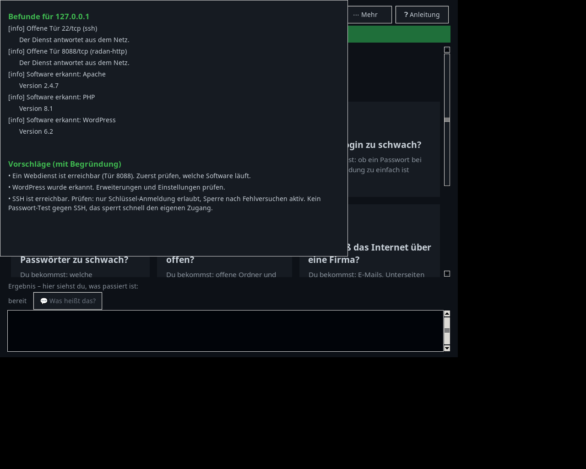
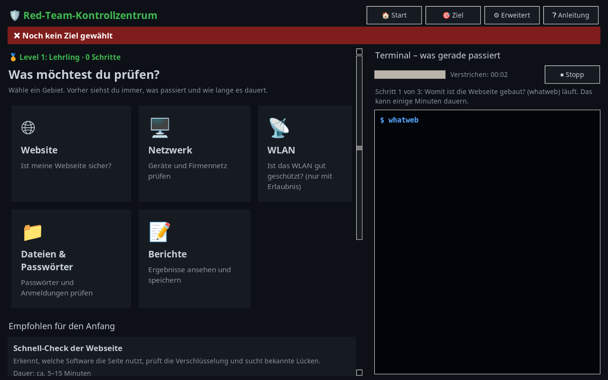
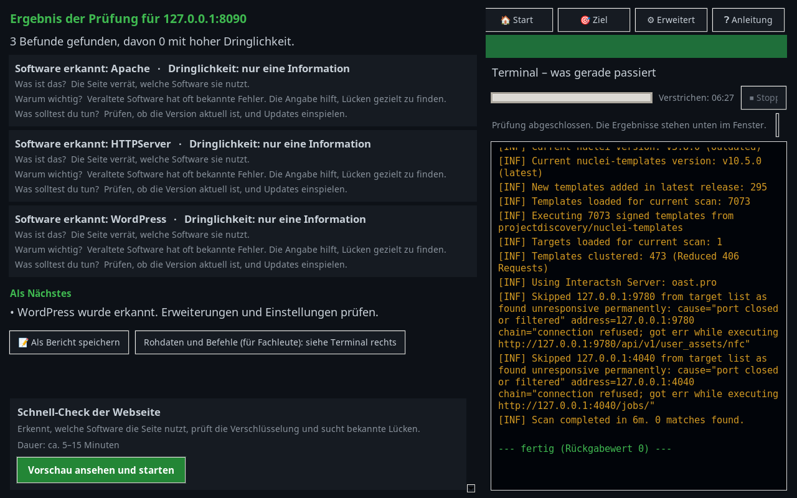

# Kontrollzentrum für Sicherheitsprüfungen: Aufbau und Entscheidungen

Ein lokales Programm mit grafischer Oberfläche (Python, Tkinter), das Sicherheitsprüfungen
für Einsteiger strukturiert: vom Ziel über die Freigabe bis zum Bericht.

**Dieser Ordner enthält nur die Beschreibung, keinen Code der Werkzeug-Aufrufe.** English version: [README.en.md](README.en.md)

## Die Idee

Viele Einsteiger wissen nicht, was sie zuerst tun sollen. Das Programm führt deshalb über **Wege**
(„Ist meine Webseite sicher?“), und jeder Weg sagt vorher:

- was man **braucht** (z. B. eine Webadresse),
- was **passiert**,
- was man **danach bekommt** (Wissen oder Zugang).

## Wichtigster Grundsatz: Freigabe vor jeder Prüfung

Vor dem ersten Start bei einem Ziel fragt das Programm nach einer **schriftlichen Freigabe**:
Wer hat freigegeben, und bestätigt der Benutzer das ausdrücklich?
Ohne diese Angaben startet kein Werkzeug. Die Freigabe wird mit Datum gespeichert und landet im Bericht.

Die Freigabe ist eine Entscheidung der Oberfläche, nicht des Werkzeugs. Deshalb steht sie an der
Stelle, die jeden Start prüft.

## Aufbau

| Teil | Aufgabe |
|---|---|
| **Oberfläche** | Fenster, Reiter, Vorschau je Weg, Erklärungen. Keine Logik zur Ausführung. |
| **Ausführung** | Startet Werkzeuge im Hintergrund und liefert die Ausgabe über eine **Warteschlange** an das Fenster zurück. Tkinter ist nicht thread-sicher, deshalb darf nur das Hauptfenster Bildschirmelemente ändern. |
| **Daten** | Ziele, Freigaben, Fortschritt und Berichte liegen in einfachen JSON-Dateien neben dem Programm. Keine Datenbank nötig. |
| **Wissen** | Erklärungen je Werkzeug als Text mit festen Feldern: Was ist das, was brauche ich, Beispiel, was bekommst du, Vorsicht. |
| **Übersetzung** | Die Rohausgabe einiger Werkzeuge wird in einfache Sätze umgewandelt. Das ist eine reine Textfunktion ohne Oberfläche und damit leicht prüfbar. |

## Fortschritt und Level

Jeder abgeschlossene Schritt zählt als Punkt. Die Stufen (Lehrling, Späher, Prüfer, Experte) zeigen den Lernfortschritt.
Der Fortschritt wird nach jedem Schritt gespeichert und bleibt nach einem Neustart erhalten.

## Bericht

Jede Prüfung kann als Markdown-Bericht gespeichert werden: Ziel, Freigabe mit Datum, abgeschlossene Schritte und das Ergebnis.
Fehlt die Freigabe, steht das im Bericht ausdrücklich.

## Bildfolge (ein Beispiellauf mit Beispieldaten)

| Schritt | Bild |
|---|---|
| 1. Startseite |  |
| 2. Weg mit Ziel und Freigabe |  |
| 3. Ergebnis des Schritts |  |
| 4. Ergebnis in einfachen Worten |  |

## Tests

- **Ablauf-Tests:** Die Oberfläche wird auf einem virtuellen Bildschirm (Xvfb) gestartet. Tests klicken Wege an, prüfen die Freigabe-Sperre und den Fortschritt, und vergleichen die Ergebnisse.
- **Datenschutz der Tests:** Jeder Test legt seine Dateien in einen eigenen Ordner. Die echten Daten werden nie verändert.
- **Logik-Tests:** Die Empfehlung des Assistenten und die Übersetzung der Ausgabe sind reine Funktionen und haben eigene Prüfungen.
- **Fehler, die die Tests fanden:** Oberflächenzugriffe aus Hintergrund-Threads (führten zu Abstürzen), doppelt belegte Zeilen in Dialogen, und ein Testlauf, der versehentlich echte Dateien veränderte. Die Ursachen sind behoben, und die Tests isolieren seitdem alles.

## Aufbau des Codes

Die Oberfläche ist in Module pro Ansicht aufgeteilt (Startseite und Wege, Ziele, Schritte, Werkzeugkiste, WLAN, Hilfe, Assistent).
Gemeinsame Grundlagen stehen in einer eigenen Datei. Nicht erreichbarer Code (eine alte Kategorien-Ansicht) wurde entfernt.
Jedes Modul wird mit pyflakes geprüft.

## Umfang, Beweise und Befunde

- **Umfang:** Bei der Freigabe legt man fest, welche IP-Adressen, Netze oder Domains geprüft werden dürfen. Ein Ziel außerhalb wird vor jedem Start abgelehnt. Eine Freigabe kann ein Ablaufdatum haben.
- **Lauf-Engine:** Läufe laufen im Hintergrund, mit Warteschlange, Zeitlimit und Abbruch (der ganze Prozessbaum wird beendet). Läufe, die beim Beenden der App liefen, werden beim nächsten Start als „unterbrochen“ markiert.
- **Beweisprotokoll:** Jeder Lauf bekommt einen Eintrag mit Befehl, Rückgabe, Zeit und SHA-256-Prüfsumme des Protokolls.
- **Befunde:** Die Ausgabe von vier Werkzeugen wird in strukturierte Funde umgewandelt (Titel, Schweregrad, Detail). Gleiche Funde aus verschiedenen Läufen werden über einen Fingerabdruck zusammengeführt.
- **Vorschläge mit Begründung:** Einfache Regeln sagen, welcher Schritt als Nächstes sinnvoll ist und warum (z. B. „Ein Webdienst ist erreichbar, deshalb zuerst prüfen, welche Software läuft“). Es gibt bewusst keine Vorschläge zum Angreifen.
- **Berichte:** Markdown, JSON, CSV und HTML, mit Freigabe, Umfang, Funden und Empfehlungen.

## Testbericht (zusammengefasst)

- **13 Prüfbereiche**, darunter Lauf-Engine (echte Prozesse: Zeitlimit, Abbruch, Warteschlange, Wiederaufnahme), Umfang und Freigabe, Beweisprotokoll, Parser, Berichte in vier Formaten und die Oberfläche. Alle grün.
- **Labortest:** Eine lokale Testseite, die sich als WordPress ausgibt. Die Erkennung und die Vorschläge stimmen. Dabei wurden zwei Fehler gefunden und behoben (Farbcodes in der Ausgabe; ein Webdienst auf einem ungewöhnlichen Port).
- **Test gegen einen eigenen Server aus dem Internet:** Die Firewall lässt nur SSH durch. Der Scan findet genau diesen einen Port und schlägt keinen Webschritt vor. Ein Passwort-Test gegen SSH wurde bewusst weggelassen, weil der Server nach Fehlversuchen sperrt.
- **Noch offen:** Playbooks (feste Abfolgen mit Verzweigung), eine Ansicht für den Vergleich zweier Stände, und die Messung gegen eine richtige Übungsmaschine.

## Einfache Bedienung (Stand: zweite Umbaurunde)

- **Startseite:** „Was möchtest du prüfen?“ mit fünf Kategorien (Website, Netzwerk, WLAN, Dateien & Passwörter, Berichte).
  Darunter drei empfohlene Prüfungen mit Erklärung und ungefährer Dauer. Technische Bereiche liegen hinter „Erweitert“.
- **Vorschau vor jeder Prüfung:** Ziel, erlaubter Umfang, Schritte (mit Hinweis, wenn ein Werkzeug fehlt), Dauer und mögliche Auswirkungen.
  Der Start bleibt gesperrt, bis die Erlaubnis bestätigt und das Häkchen gesetzt ist. Der Umfang wird vor **jedem** Schritt erneut geprüft.
- **Ablauf:** Fortschritt („Schritt 2 von 3“), Uhr und Stopp-Taste. Ein fehlendes Werkzeug wird übersprungen, die Prüfung läuft weiter.
- **Ergebnis in Klartext:** Was ist das, warum ist es wichtig, was solltest du tun. Rohdaten und Befehle bleiben im Terminal rechts.

**Messung gegen die Übungsmaschine (acht bekannte Befunde):** Im ersten Lauf fand das Programm 6 von 8. Zwei Lücken lagen an meiner Übungsseite (falsche Anführungszeichen beim WordPress-Hinweis, reiner Text statt HTML bei der Versionsseite). Nach der Korrektur fand es 7 von 8. Offen bleibt die PHP-Version, die das Werkzeug für bekannte Lücken nicht erkennt.

**Echter Lauf (ehrlich):** Die Schnell-Prüfung lief gegen die eigene Übungsmaschine. Alle drei Schritte liefen durch.
Gefunden wurden drei Software-Angaben (Apache, HTTP-Server, WordPress), keine Lücke mit hoher Dringlichkeit.
Das Werkzeug für bekannte Lücken fand auf dieser Maschine nichts. Das ist ein Messergebnis, kein Fehler.

## Gemessene Dauern (Übungsmaschine, ein Rechner)

Die Vorschau zeigt die Dauer jetzt aus Messungen statt aus Schätzungen. Gemessen wurde jeder Schritt einzeln, so wie die App ihn ausführt:

| Schritt | Dauer | Erfolg |
|---|---|---|
| whatweb | 3.7 s | ja |
| sslscan | 0.0 s | ja |
| nmap | 0.1 s | ja |
| gobuster | 6.7 s | ja |
| nikto | 20.5 s | ja |
| nuclei | 359.6 s | ja |
| enum4linux | 11.1 s | ja |
| netexec | 4.7 s | ja |

Die Zeiten gelten für diese eine Testmaschine. Auf echten Netzen mit Windows-Rechnern oder großen Webseiten dauert es länger. Die Windows-Schritte liefen hier ins Leere, weil die Übungsmaschine keine Windows-Freigaben hat.

## Was bewusst nicht drin ist

- Keine Zusammenstellung von Angriffsbefehlen für fremde Ziele.
- Keine Werkzeugauswahl, die ohne Freigabe startet.
- Keine Speicherung von Zugangsdaten.

## Was man daraus lernt

Sicherheit beginnt bei der Organisation: Wer prüft, braucht eine Erlaubnis, muss wissen, was er tut, und sollte es dokumentieren.
Das Programm macht diese Schritte zur Pflicht, bevor etwas gestartet wird.
